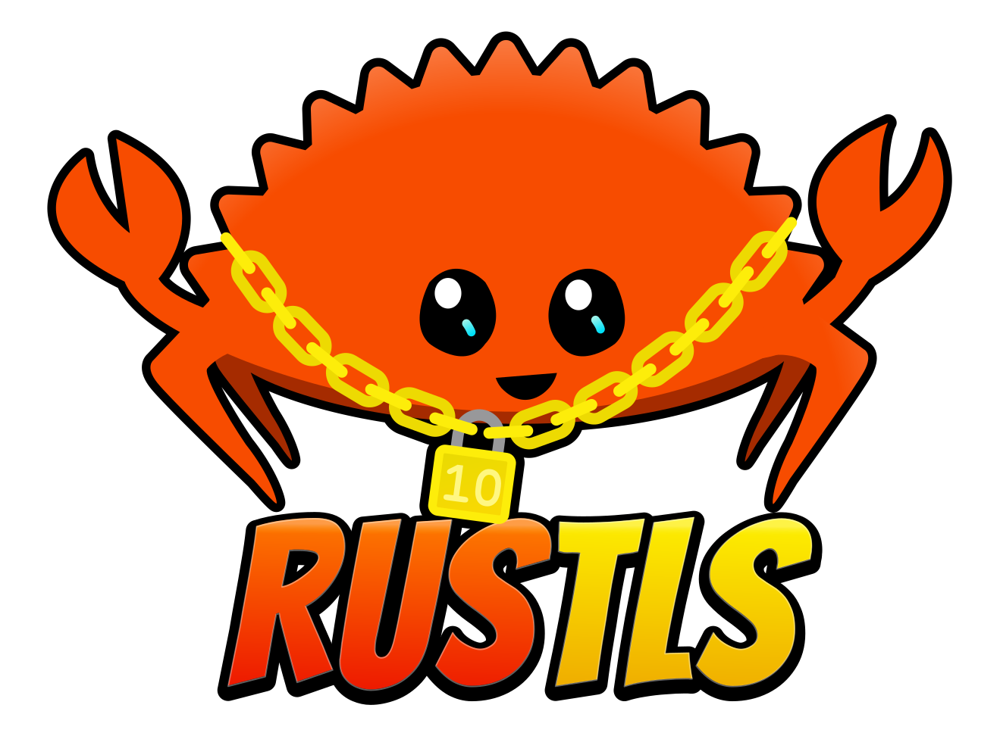
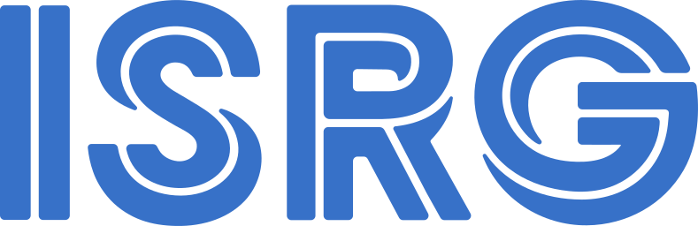

# Rust Ecosystem Work Seeking Support

This directory lists Rust ecosystem work seeking funding from companies using Rust at scale. It includes work on the Rust compiler, Cargo, tooling, libraries, and crates published on crates.io.

The initiatives below represent active funding opportunities. Most already have at least one supporting organization and are looking for additional partners.

Rust Foundation Ecosystem Fund (RFEF) sponsors may receive recognition, fund reporting, sponsorship coordination, and advance security disclosures when coordinated private notice is needed.

## How to Help

Most listed work can be supported through the Rust Foundation Ecosystem Fund (RFEF), which directs funding to the maintainers or projects doing the work. For all Rust Project goals seeking support, see the [Rust Project Goals funding page][project-goals-funding]. If an organization wants to support Rust maintainers more generally, please check out the  [Rust Project Funding page](https://rust-lang.org/funding/) where you can support the Rust Foundation Maintainers Fund or individual Rust project members.

Funding does not buy control over Rust technical decisions, RFC outcomes, stabilization, release timing, maintainer review, priority, or project roadmaps.

Depending on the item, support may go to an individual maintainer, a project, a fiscal host, an employer, or a foundation. Rust Project work still goes through the normal team review process, including RFCs, ACPs, implementation review, and stabilization where applicable. Project goals provide public context and coordination; they are not approval of a specific design or priority.

Use public project venues for technical feedback when possible. If confidential build data, deployment details, or production traces would be useful, contact the RCN mailbox, the relevant maintainer, or the Foundation before sharing them. Non-confidential conclusions should be summarized publicly when practical.

Named contributors and related projects are included to identify likely contacts and work owners. Inclusion does not mean the RCN, Rust Foundation, or Rust Project has endorsed a specific technical decision.

## Contact

For general questions about ecosystem funding, procurement, or sharing private production feedback, come to [Funding Initiative office hours](./funding-office-hours.md). For async public discussion, join us on the [commercial-network channel in Rust Project Zulip][zulip]. For private discussion or to schedule private office hours, contact [rust-commercial-network@rustfoundation.org][rcn-email].

For project-specific billing questions, use the billing contact listed inline beneath that project's funding status.

## Build Performance

### Wild

Wild is a [Rust Innovation Lab](https://rustfoundation.org/rust-innovation-lab/) project building a faster linker for Rust workloads. It addresses link time as a visible cost in CI or local development. Current work is aimed at large binaries, more platforms, and the missing linker features that prevent projects from trying Wild today.

The most useful sponsor input is real build data: linker timing profiles, crate graph shape, binary size, platform constraints, and failure cases. Funding also supports basic maintenance, PR review, and platform support work. Organizations planning contributions can use this support to coordinate with Wild's maintainers, while maintainers continue to prioritize work that fits Wild's goals and available time.

Led by [David Lattimore (@davidlattimore)](https://github.com/davidlattimore). Related project: [Wild](https://github.com/wild-linker/wild).

| Q3 '26 | Q4 '26 | Q1 '27 | Q2 '27 |
|--------|--------|--------|--------|
| ⚠️ Partial | ⚠️ Partial | ⚠️ Partial | ⚠️ Partial |

<strong>Sponsors:</strong> 

<strong>Fiscal sponsor:</strong> 

**Billing contact:** Joel Marcey ([contact](https://calendly.com/joelmarcey), [profile](https://github.com/JoelMarcey)).

### Faster Builds Roadmap

The Faster Builds Roadmap is aimed at organizations where build time affects developer wait time, CI spend, or release latency. It would fund [bjorn3 (@bjorn3)][bjorn3] for an additional day per week of Rust build performance work, complementing time already contributed through [Tweede Golf][tweede-golf].

bjorn3 would spend the funded time on the roadmap items most likely to shorten real build times.

Related: [Faster Builds Roadmap][faster-builds-roadmap].

| Q3 '26 | Q4 '26 | Q1 '27 | Q2 '27 |
|--------|--------|--------|--------|
| ⚠️ Partial | ⚠️ Partial | ⚠️ Partial | ⚠️ Partial |

<strong>Sponsors:</strong> 

<strong>Fiscal sponsor:</strong> 

**Billing contact:** Erik Jonkers ([contact](mailto:erik@rustnl.org), [RustNL](https://rustnl.org/)).

**Contributor:** bjorn3 ([contact](https://rust-lang.zulipchat.com/#narrow/dm/133247-bjorn3), [profile](https://github.com/bjorn3)).

### Cargo Cross-Workspace Cache

Cargo Cross-Workspace Cache would reduce duplicate build artifacts across Cargo workspaces. It targets teams losing CI time, disk space, or local setup time to repeated Cargo artifacts. A shared cache could cut repeated CI minutes and disk use, provided it holds up against production build patterns.

[Ross Sullivan (@ranger-ross)](https://github.com/ranger-ross) is seeking support to design and implement a first version that the Cargo team can evaluate. If accepted, support would carry the work through normal Cargo review and nightly testing. Useful data includes build times, cache hit rates, cache storage costs, workspace structure, and failure cases.

Related: [Cargo Cross-Workspace Cache][cargo-cross-workspace-cache], [Cargo][cargo].

| Q3 '26 | Q4 '26 | Q1 '27 |
|--------|--------|--------|
| ✅ Funded | ✅ Funded | ⚠️ Partial |

<strong>Sponsors:</strong> 

<strong>Fiscal sponsor:</strong> 

**Billing contact:** Jess Izen ([contact and profile](https://book.jessizen.com/)).

### Reusable Build Artifacts

Today, `cargo check` and `cargo build` largely duplicate work, which matters for teams that run both in local development or CI. This project aims to make build artifacts reusable across both workflows, so work done for `cargo check` can carry into `cargo build`.

Funding would give [Alejandra Gonzalez (@blyxyas)](https://github.com/blyxyas) time to pursue a new incremental compilation design. This work may also support Cargo Cross-Workspace Cache and other build reuse work.

Related: [Incremental Compilation System, Rethought][incremental-system-rethought], [rust-lang/rust][rust-lang-rust].

| Q3 '26 | Q4 '26 | Q1 '27 | Q2 '27 |
|--------|--------|--------|--------|
| ⚠️ Partial | ⚠️ Partial | ⚠️ Partial | ⚠️ Partial |

<strong>Sponsors:</strong> 

<strong>Fiscal sponsor:</strong> 

**Project contact:** Alejandra González ([contact](https://rust-lang.zulipchat.com/#narrow/dm/560802-Alejandra-Gonzalez), [profile](https://github.com/blyxyas)).

### Cranelift

Cranelift is an alternative Rust code generation backend. The current goal is a 2x speedup in Cranelift code generation for debug builds, reducing local compile time for teams rebuilding large Rust services many times per day.

Sponsor support would cover time for [bjorn3 (@bjorn3)][bjorn3] and [Folkert de Vries (@folkertdev)][folkertdev], through [Tweede Golf][tweede-golf], to work through the performance improvements in the project goal.

Related: [Cranelift Performance Improvements][cranelift-performance], [Cranelift][cranelift].

| Q3 '26 | Q4 '26 | Q1 '27 | Q2 '27 |
|--------|--------|--------|--------|
| ✅ Funded | ⚠️ Partial | ⚠️ Partial | ⚠️ Partial |

<strong>Sponsors:</strong> 

<strong>Fiscal sponsor:</strong> 

**Billing contact:** Erik Jonkers ([contact](mailto:erik@rustnl.org), [RustNL](https://rustnl.org/)).

**Contributor:** bjorn3 ([contact](https://rust-lang.zulipchat.com/#narrow/dm/133247-bjorn3), [profile](https://github.com/bjorn3)).

## Developer Experience and Tooling

### cargo-nextest

`cargo-nextest` is a Rust test runner used in local development and CI. For teams whose Rust test suites gate releases, slow or flaky runs can delay shipping. Maintenance funding pays for the work users rely on but do not always see: releases, issue triage, contributor review, platform support, and CI-scale fixes.

Funding would buy down unpaid maintenance work for [Rain (@sunshowers)](https://github.com/sunshowers): releases, issue triage, contributor review, and fixes requested by users running nextest in CI. Organizations planning contributions can use this support to coordinate with Rain before investing in implementation, while technical decisions and reviews continue through the project's public channels.

Related: [cargo-nextest](https://nexte.st/).

| Q3 '26 | Q4 '26 | Q1 '27 | Q2 '27 |
|--------|--------|--------|--------|
| ⚠️ Partial | ⚠️ Partial | ⚠️ Partial | ⚠️ Partial |

<strong>Sponsors:</strong> 

<strong>Fiscal sponsor:</strong> 

**Billing contact:** Rain ([contact and profile](https://github.com/sunshowers)).

### Symposium

[Symposium](https://symposium.dev/) helps Rust crates provide agent skills, MCP servers, and other development extensions based on project dependencies. Supported by AWS and [WyeWorks](https://www.wyeworks.com/), funding covers feature development and basic maintenance, including releases, issue triage, integration work, and review of contributions.

Organizations planning contributions can use this support to coordinate with Symposium's maintainers before investing in implementation. Technical direction and contribution review remain with the project.

Related: [Symposium](https://symposium.dev/), [Symposium on GitHub](https://github.com/symposium-dev/symposium).

| Q3 '26 | Q4 '26 | Q1 '27 | Q2 '27 |
|--------|--------|--------|--------|
| ✅ Funded | ⚠️ Partial | ⚠️ Partial | ⚠️ Partial |

<strong>Sponsors:</strong> <a href="https://www.wyeworks.com/" title="WyeWorks">WyeWorks</a>

<strong>Fiscal sponsor:</strong> 

**Billing contact:** Joel Marcey ([contact](https://calendly.com/joelmarcey), [profile](https://github.com/JoelMarcey)).

### cargo-semver-checks

`cargo-semver-checks` helps Rust maintainers catch accidental SemVer breakage before publishing releases. This is especially useful for SDKs and libraries where breaking changes can disrupt downstream customers and make dependency upgrades risky.

Funding would support work to close major coverage gaps and improve PR-based workflows. Current limitations include missing type-related breaking changes, missing cross-crate analysis for re-exports, and difficulty distinguishing breakage introduced by a new PR from breakage that already exists since the last published release.

Related:
- [cargo-semver-checks][cargo-semver-checks]
- [roadmap](https://predr.ag/blog/cargo-semver-checks-2025-year-in-review/#the-path-forward-for-2026-and-beyond)
- [project goal][cargo-semver-checks-goal]
- [goal tracking issue][cargo-semver-checks-goal-tracking]

| Q3 '26 | Q4 '26 | Q1 '27 | Q2 '27 |
|--------|--------|--------|--------|
| ⚠️ Partial | ⚠️ Partial | ⚠️ Partial | ⚠️ Partial |

<strong>Sponsors:</strong> 

<strong>Fiscal sponsor:</strong> 

**Billing contact:** Predrag Gruevski ([contact](https://rust-lang.zulipchat.com/#narrow/dm/474284-Predrag-Gruevski), [profile](https://github.com/obi1kenobi)).

### Cargo Maintenance

Many Rust roadmap items need Cargo review or implementation work, including work on supply-chain policy, build reproducibility, C++ interoperability, signed crates, and sandboxed build scripts. This item funds general Cargo review and implementation time, not reserved reviewer time for funder-requested changes.

The work would be delivered through a Rust Project Maintainer in Residence, with the incoming maintainer providing Cargo review, mentoring, implementation, and support for moving accepted changes through review. Cargo maintainers and Rust Project teams retain authority over review, acceptance, prioritization, and release timing.

Related: [Cargo][cargo], [crates.io][crates-io].

| Q3 '26 | Q4 '26 | Q1 '27 | Q2 '27 |
|--------|--------|--------|--------|
| ⚠️ Partial | ⚠️ Partial | ⚠️ Partial | ⚠️ Partial |

<strong>Sponsors:</strong> 

<strong>Fiscal sponsor:</strong> 

**Billing contact:** Jess Izen ([contact and profile](https://book.jessizen.com/)).

### C and C++ Interoperability

Many organizations adopting Rust continue to operate in mixed-language environments. Improving interoperability with existing C and C++ codebases lowers adoption barriers, simplifies migrations, and makes it easier to incrementally introduce Rust into existing systems.

Funding would support work by [teor (@teor2345)](https://github.com/teor2345), [folkertdev (Folkert de Vries)](https://github.com/folkertdev) at Tweede Golf, and other collaborators working to identify and address high-impact interoperability gaps between Rust and C/C++.

Dozens of interoperability problem statements and use cases have already been identified with industry participants, and new implementation efforts continue to emerge from that work. Current areas of interest include support for C floating-point types such as `long double`, function overloading, variable arguments, smoother Rust onboarding into existing C++ projects, build and linking improvements, and other high-impact gaps.

Links:

- [Interop Initiative issue tracker](https://github.com/rustfoundation/interop-initiative/issues)
- [Detailed problem statements](https://github.com/rustfoundation/interop-initiative/tree/main/problem-space)
- [Interop project goals and proposals](https://docs.google.com/document/d/1pFOUJXcs3bZKsCwrMOVHaCbjSe8XEb5ZtHux_4nTwp0/edit?usp=drivesdk)
- [Interop work inventory](https://docs.google.com/document/d/1-REi68Us_fPOlW1GlEmEqdbtDJAt4UjhBgnXHs-NEmc/edit?usp=drivesdk)
- [C floating-point interoperability (`f80`, `f128`, `c_longdouble`)](https://rust-lang.github.io/rust-project-goals/2026/interop-f80-f128.html)

| Q3 '26 | Q4 '26 | Q1 '27 | Q2 '27 |
|--------|--------|--------|--------|
| ⚠️ Partial | ⚠️ Partial | ⚠️ Partial | ⚠️ Partial |

<strong>Sponsors:</strong> 

<strong>Fiscal sponsors:</strong> 

**Billing contacts:** teor ([contact](https://rust-lang.zulipchat.com/#narrow/dm/325209-teor), [profile](https://github.com/teor2345)) and Erik Jonkers ([contact](mailto:erik@tweedegolf.com), [profile](https://tweedegolf.nl/en/about/6/erik/)).

### Crate Namespaces

Crate namespaces would help organizations publishing related crate families, internal platform crates, SDKs, or official packages. Namespaces would let those crates live under one namespace, making ownership clearer and reducing collisions with similarly named crates.

Implementation work is underway across rustc, Cargo, and crates.io. Funding would help contributors such as [Takayuki Maeda (@TaKO8Ki)](https://github.com/TaKO8Ki) continue implementing RFC 3243 and related changes. Cargo, crates.io, and rust-lang teams still decide design and policy questions through their normal processes.

Related: [RFC 3243][rfc-3243], [2026 project goal](https://rust-lang.github.io/rust-project-goals/2026/open-namespaces.html), [Cargo][cargo], [crates.io][crates-io], [rust-lang/rust][rust-lang-rust].

| Q3 '26 | Q4 '26 | Q1 '27 |
|--------|--------|--------|
| ❌ Not funded | ❌ Not funded | ❌ Not funded |

<strong>Fiscal sponsor:</strong> 

**Project contact:** Takayuki Maeda ([contact](https://rust-lang.zulipchat.com/#narrow/dm/343125-Takayuki-Maeda), [profile](https://github.com/TaKO8Ki)).

### Native async fn dynamic dispatch in traits

Rust supports async fn in traits, but using async methods through dyn trait objects still requires workarounds such as #[async_trait], which add allocation overhead, obscure signatures, and split the ecosystem between native async traits and boxed trait-object patterns.

Funding would support work by [Santiago Pastorino (@spastorino)](https://github.com/spastorino) and [Jack Huey (@jackh726)](https://github.com/jackh726) to make async trait methods usable through dynamic dispatch. The work has two parts: first, making Rust more precise about which trait methods are dyn-compatible, and second, adding native support for async dispatch through trait objects.

The goal is to reduce reliance on #[async_trait], give library authors a cleaner path for async trait APIs, and make the feature available for real-world testing on nightly before final syntax is designed.

Related: [Async fn in Traits][async-fn-traits], [rust-lang/rust][rust-lang-rust].

| Q3 '26 | Q4 '26 | Q1 '27 | Q2 '27 |
|--------|--------|--------|--------|
| ⚠️ Partial | ⚠️ Partial | ⚠️ Partial | ⚠️ Partial |

<strong>Fiscal sponsor:</strong> <a href="https://www.wyeworks.com/" title="WyeWorks">WyeWorks</a>

**Billing contact:** Santiago Pastorino ([contact](https://rust-lang.zulipchat.com/#narrow/dm/116266-Santiago-Pastorino), [profile](https://github.com/spastorino)).

## Language and Compiler

### Async State Machine Improvements

Rust's async implementation generates state machines behind the scenes. For async services, better state-machine generation can reduce CPU use, memory pressure, binary size, and compiler limits such as maximum query recursion depth.

[Dion Dokter (@diondokter)](https://github.com/diondokter) at [Tweede Golf][tweede-golf] is seeking support to continue async state machine code generation work.

Related: [project goal][async-state-machine-goal], [background][async-state-machine-background], [rust-lang/rust][rust-lang-rust].

| Q3 '26 | Q4 '26 |
|--------|--------|
| ✅ Funded | ⚠️ Partial |

<strong>Sponsors:</strong> 

<strong>Fiscal sponsor:</strong> 

**Billing contact:** Erik Jonkers ([contact](mailto:erik@tweedegolf.com), [profile](https://tweedegolf.nl/en/about/6/erik/)).

**Contributor:** Dion Dokter ([contact](https://rust-lang.zulipchat.com/#narrow/dm/631861-Dion-Dokter), [profile](https://github.com/diondokter)).

### rustc_public

`rustc_public`(formerly Stable MIR) is intended to give external tools a supported way to read compiler data without depending on unstable rustc internals. That matters for static analysis, verification, GPU, compliance, and internal platform tooling.

The next project goal is still pending. Funding would help [Makai (@makai410)](https://github.com/makai410) and the Rustc Public project publish `rustc_public` to crates.io, expand API coverage, and improve documentation. API additions should be evaluated for general Rust tooling value, not for any one downstream project.

Related: [previous project goal][stable-mir-previous-goal], [rust-lang/rust][rust-lang-rust]. The next project goal has not been published yet.

| Q3 '26 | Q4 '26 | Q1 '27 | Q2 '27 |
|--------|--------|--------|--------|
| ❌ Not funded | ❌ Not funded | ❌ Not funded | ❌ Not funded |

<strong>Fiscal sponsor:</strong> 

**Billing contact:** Makai ([contact](https://rust-lang.zulipchat.com/#narrow/dm/759102-Makai), [profile](https://github.com/makai410)).

### Binary Size Reduction

A roadmap is being prepared for binary size reduction work led by [Nia Espera (@nia-e)](https://github.com/nia-e) and [Hexcat (@hexcatnl)](https://github.com/hexcatnl). The work is aimed at cases where Rust binary size affects cold-start time, memory footprint, storage pressure, firmware size, or rollout cost. Once the roadmap is published, support should focus on reductions that translate into lower cold-start time, smaller firmware or container images, and lower rollout cost for size-sensitive Rust users.

This is a funding interest area, not an approved Rust Project goal or committed outcome.

Related: [rust-lang/rust][rust-lang-rust]. Binary-size roadmap link to be added once published.

| Q3 '26 | Q4 '26 | Q1 '27 | Q2 '27 |
|--------|--------|--------|--------|
| ⚠️ Partial | ⚠️ Partial | ⚠️ Partial | ⚠️ Partial |

<strong>Sponsors:</strong> 

<strong>Fiscal sponsor:</strong> 

**Billing contact:** Mara Bos ([contact](mailto:mara@rustnl.org), [profile](https://github.com/m-ou-se)). **Project contact:** Nia ([contact](https://rust-lang.zulipchat.com/#narrow/dm/571657-Nia), [profile](https://github.com/nia-e)).

### Declarative Macro Improvements

Better declarative macros could replace some proc macros, cutting build time, dependency surface area, and supply-chain review burden. That helps where dependency review, supply-chain controls, or build-time code execution policies make proc macros expensive to adopt.

Funding would help [Josh Triplett (@joshtriplett)](https://github.com/joshtriplett) work on declarative attributes and derive macros. It may also support related work by [Oli Scherer (@oli-obk)](https://github.com/oli-obk) on compile-time Rust evaluation, or "comptime". Design questions remain subject to the relevant RFC, lang/compiler team, and stabilization processes.

Related: [Declarative Macro Improvements][declarative-macro-improvements], [rust-lang/rust][rust-lang-rust].

| Q3 '26 | Q4 '26 | Q1 '27 | Q2 '27 |
|--------|--------|--------|--------|
| ❌ Not funded | ❌ Not funded | ❌ Not funded | ❌ Not funded |

<strong>Fiscal sponsor:</strong> 

**Billing contact:** Josh Triplett ([contact](https://rust-lang.zulipchat.com/#narrow/dm/239881-Josh-Triplett), [profile](https://github.com/joshtriplett)).

## Production Systems

### Tokio Maintenance

[Tokio](https://tokio.rs/) is maintained through ongoing releases, issue triage, PR review, contributor support, and coordination across its runtime and related crates. Funding supports this basic maintenance work independently of targeted runtime optimization projects.

Organizations that want to contribute to Tokio can use this support to coordinate with maintainers before investing in implementation. Current sponsorship covers the displayed baseline maintenance period, while additional support can expand maintenance capacity and sustain it beyond those quarters. Funding does not buy technical priority or change Tokio's public design and review process.

Related: [Tokio][tokio], [Tokio on GitHub](https://github.com/tokio-rs/tokio).

| Q3 '26 | Q4 '26 | Q1 '27 | Q2 '27 |
|--------|--------|--------|--------|
| ✅ Funded | ✅ Funded | ✅ Funded | ✅ Funded |

<strong>Sponsors:</strong> 

<strong>Fiscal sponsor:</strong> 

**Billing contact:** Carl Lerche ([contact and profile](https://github.com/carllerche)).

### Tokio Runtime Optimizations

[Tokio](https://tokio.rs/) is the foundation for many Rust network services and async applications. Runtime and scheduler work matters when production workloads combine network IO, timers, and compute-heavy tasks, especially where scheduler behavior affects latency, fairness, CPU use, or incident risk.

[Folkert de Vries (@folkertdev)][folkertdev] at [Tweede Golf][tweede-golf] is seeking support for runtime and scheduler improvements in Tokio. Production feedback from large Tokio users would be useful, especially where scheduler behavior affects latency or incidents. Maintainers still make changes through Tokio's public design and review process.

Related: [Tokio][tokio], [time-based cooperative scheduling prototype][tokio-coop-prototype], [runtime optimization discussion][tokio-runtime-discussion].

| Q3 '26 | Q4 '26 | Q1 '27 | Q2 '27 |
|--------|--------|--------|--------|
| ✅ Funded | ❌ Not funded | ❌ Not funded | ❌ Not funded |

<strong>Sponsors:</strong> 

<strong>Fiscal sponsor:</strong> 

**Billing contact:** Erik Jonkers ([contact](mailto:erik@tweedegolf.com), [profile](https://tweedegolf.nl/en/about/6/erik/)).

**Contributor:** Folkert de Vries ([contact](https://rust-lang.zulipchat.com/#narrow/dm/416089-Folkert-de-Vries), [profile](https://github.com/folkertdev)).

### rustls

[rustls][rustls] is a Rust Innovation Lab project that provides TLS functionality for many Rust applications and services. Production services that terminate or initiate TLS depend on timely security response, compatibility, and connection-heavy performance. Maintenance support helps pay for security response, releases, dependent-crate compatibility, and production feedback work that otherwise competes with limited maintainer time.

[Dirkjan Ochtman (@djc)](https://github.com/djc) is seeking maintenance time for rustls security coordination, releases, contribution review, 1.0 work, async handshake performance, and production-user feedback. Organizations planning contributions can use this support to coordinate with rustls maintainers before investing in implementation.

Related: [rustls][rustls].

| Q3 '26 | Q4 '26 | Q1 '27 | Q2 '27 |
|--------|--------|--------|--------|
| ⚠️ Partial | ⚠️ Partial | ⚠️ Partial | ⚠️ Partial |

<strong>Sponsors:</strong> 

<strong>Fiscal sponsor:</strong> 

**Billing contact:** Joel Marcey ([contact](https://calendly.com/joelmarcey), [profile](https://github.com/JoelMarcey)).

### dial9 Maintenance and Feature Development

[dial9](https://github.com/dial9-rs/dial9-tokio-telemetry) is a flight recorder for diagnosing performance problems in Tokio and other applications running in production. Funding supports ongoing PR review, platform support, performance optimizations, and feature development through [WyeWorks](https://www.wyeworks.com/).

| Q3 '26 | Q4 '26 | Q1 '27 | Q2 '27 |
|--------|--------|--------|--------|
| ⚠️ Partial | ⚠️ Partial | ⚠️ Partial | ⚠️ Partial |

<strong>Sponsors:</strong> 

<strong>Fiscal sponsor:</strong> <a href="https://www.wyeworks.com/" title="WyeWorks">WyeWorks</a>

**Billing contact:** Santiago Pastorino ([contact](https://rust-lang.zulipchat.com/#narrow/dm/116266-Santiago-Pastorino), [profile](https://github.com/spastorino)).

### Hyperium

[Hyperium][hyperium] maintains Hyper, Tower, h2, and related networking crates used by Rust services. Teams depend on those crates for availability, protocol correctness, observability, and performance.

[Sean McArthur (@seanmonstar)](https://github.com/seanmonstar) is seeking time for the work that keeps Hyperium crates healthy: releases, issue triage, contribution and PR review, modularization, h2 performance, buffer pooling, observability, and production-user feedback. Organizations planning contributions can use this support to coordinate with Hyperium maintainers before investing in implementation.

Related: [Hyperium Roadmap][hyperium-roadmap].

| Q3 '26 | Q4 '26 | Q1 '27 | Q2 '27 |
|--------|--------|--------|--------|
| ⚠️ Partial | ⚠️ Partial | ⚠️ Partial | ⚠️ Partial |

<strong>Sponsors:</strong> 

<strong>Fiscal sponsors:</strong> 

**Billing contact:** Sean McArthur ([contact](https://rust-lang.zulipchat.com/#narrow/dm/243965-Sean-McArthur), [profile](https://github.com/seanmonstar)).

## Fully Funded

### F16 Stabilization

Many machine learning, graphics, simulation, and scientific computing workloads use 16-bit floating point formats. Native f16 support would make it easier to pass f16 data between Rust, hardware APIs, and libraries that already use those values.

Sponsor support would help [Folkert de Vries (@folkertdev)][folkertdev], through [Tweede Golf][tweede-golf], continue the implementation, testing, documentation, and review work needed before f16 can be considered for stabilization. Stabilization would still be decided through the Rust Project process.

Related: [F16 Stabilization][f16-stabilization], [rust-lang/rust][rust-lang-rust].

| Q1 '26 | Q2 '26 |
|--------|--------|
| ✅ Funded | ✅ Funded |

<strong>Sponsors:</strong> 

<strong>Fiscal sponsor:</strong> 

**Billing contact:** Erik Jonkers ([contact](mailto:erik@tweedegolf.com), [profile](https://tweedegolf.nl/en/about/6/erik/)).

**Contributor:** Folkert de Vries ([contact](https://rust-lang.zulipchat.com/#narrow/dm/416089-Folkert-de-Vries), [profile](https://github.com/folkertdev)).

[async-fn-traits]: https://rust-lang.github.io/rust-project-goals/2026/afidt-box.html#funding
[async-state-machine-background]: https://tweedegolf.nl/en/blog/237/async-rust-never-left-the-mvp-state
[async-state-machine-goal]: https://rust-lang.github.io/rust-project-goals/2026/async-statemachine-optimisation.html#funding
[bjorn3]: https://github.com/bjorn3
[cargo]: https://github.com/rust-lang/cargo
[cargo-semver-checks]: https://github.com/obi1kenobi/cargo-semver-checks
[cargo-semver-checks-goal]: https://rust-lang.github.io/rust-project-goals/2026/cargo-semver-checks.html
[cargo-semver-checks-goal-tracking]: https://github.com/rust-lang/rust-project-goals/issues/104
[cargo-cross-workspace-cache]: https://rust-lang.github.io/rust-project-goals/2026/cargo-cross-workspace-cache.html
[cranelift]: https://github.com/bytecodealliance/wasmtime/tree/main/cranelift
[cranelift-performance]: https://rust-lang.github.io/rust-project-goals/2026/improve-cg_clif-performance.html
[crates-io]: https://crates.io/
[declarative-macro-improvements]: https://github.com/rust-lang/rust-project-goals/issues/629
[f16-stabilization]: https://rust-lang.github.io/rust-project-goals/2026/stabilizing-f16.html#funding
[faster-builds-roadmap]: https://rust-lang.github.io/rust-project-goals/2026/roadmap-fast-builds.html
[folkertdev]: https://github.com/folkertdev
[hyperium]: https://hyper.rs/
[hyperium-roadmap]: https://hyper.rs/contrib/roadmap/
[incremental-system-rethought]: https://rust-lang.github.io/rust-project-goals/2026/incremental-system-rethought.html
[project-goals-funding]: https://rust-lang.github.io/rust-project-goals/2026/funding.html
[rcn-email]: mailto:rust-commercial-network@rustfoundation.org
[rfc-3243]: https://github.com/rust-lang/rfcs/issues/3243
[rust-lang-rust]: https://github.com/rust-lang/rust
[rustls]: https://rustls.dev/
[stable-mir-previous-goal]: https://github.com/rust-lang/rust-project-goals/issues/266
[tokio]: https://tokio.rs/
[tokio-coop-prototype]: https://github.com/tokio-rs/tokio/tree/time-based-coop-poc
[tokio-runtime-discussion]: https://github.com/tokio-rs/tokio/issues/8085
[tweede-golf]: https://tweedegolf.nl/
[zulip]: https://rust-lang.zulipchat.com/#narrow/channel/594428-commercial-network
