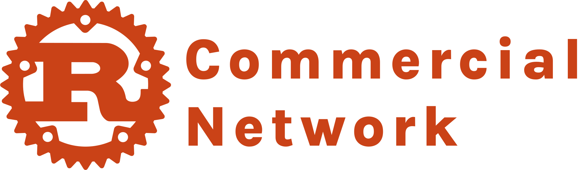

  

# Rust Commercial Network (RCN)

Where Rust users, businesses, and communities work together to make Rust easier to adopt and maintain.

The Rust Commercial Network (RCN) is a Rust Foundation group for people and organizations using Rust in professional settings. Members compare notes on adoption blockers, improve Rust supply chain health, and support the basic tooling, libraries, and maintenance work that make Rust dependable in production.

**Join:** fill out the [membership application](https://github.com/Rust-Commercial-Network/rcn/issues/new?assignees=lorilorusso&labels=membership%2Cstatus%3A+needs+review&projects=&template=membership.yml).

**Members:** see the current [RCN member list](https://rust-commercial-network.github.io/rcn/members.html).

**Fund the Rust Ecosystem:** see [Fund the Rust Ecosystem](./funding.md).

**Discuss:** use the RCN channel in the [Rust Project Zulip](https://rust-lang.zulipchat.com/).

**Calendar:** see the [RCN meeting calendar](https://bit.ly/4xngeHr).

**Rust Foundation:** see the [RCN page on the Rust Foundation site](https://rustfoundation.org/rust-commercial-network/).

## Overview

The RCN is open to Rust users of all sizes: individual commercial users, consultants, startups, small businesses, larger companies, academic users, organizations, Rust Foundation Members, Rust Advocates, and members of the Rust Project. The RCN supports industry consortiums, interest groups, working groups, and other initiatives, with review from the RCN Steering Committee.

The RCN is separate from the Rust Project's developing [Rust Society](https://github.com/jamesmunns/rust-society/blob/main/reports/pdf/2025-04-04.pdf), although there may be some overlap over time.

Membership in the RCN is free.

The RCN works to:

* Identify Rust adoption and maintenance problems shared by production users
* Form consortiums, working groups, and interest groups around industry-specific or ecosystem-wide needs
* Help members contribute time, funding, testing, documentation, and maintainer support
* Share findings with the Rust Project, ecosystem maintainers, and the Rust Foundation

## What Members Do

* Meet regularly
* Discuss topics that matter to production Rust users
* Promote industry-specific adoption of Rust
* Meet in person when possible, including at Rust Foundation events such as the Member Summit
* Work with the Rust Project and ecosystem maintainers to identify and resolve issues that affect commercial and organizational use, including tooling gaps, crate reliability, maintenance bottlenecks, and adoption papercuts
  * Members may contribute engineering time, funding, testing, maintainer support, documentation work, contributions to the Rust Foundation Maintainer's Fund, or other help

### RCN may produce:

* Best practice guides and reference architectures
* Adoption playbooks
* Feedback summaries for the Rust Project
* Gap analyses for tooling, libraries, documentation, and maintenance capacity
* Prioritized lists of papercuts and reliability issues affecting production users
* Recommendations to improve core tooling, widely used libraries, crate reliability, long-term maintenance, and Rust supply chain health

\*Individual issues can be brought up to the Project independent of the RCN. The RCN aims to identify recurring or broadly shared issues, including smaller papercuts that add up to adoption, reliability, or maintenance problems across organizations.

## RCN Initiatives: Interest Groups, Working Groups, and Consortiums

RCN members can propose initiatives focused on shared adoption blockers, ecosystem maintenance, or industry-specific needs. These initiatives may be formally organized as interest groups, working groups, or consortiums which can produce guides, reports, recommendations, or other outputs for the Rust community.

To propose an initiative, [file an application using the GitHub Issue template](https://github.com/Rust-Commercial-Network/rcn/issues/new?assignees=lorilorusso&labels=initiative-proposal%2Cstatus%3A+needs+review&projects=&template=initiative_proposal.yml). See [RCN Initiatives: Interest Groups, Working Groups, and Consortiums](./initiatives.md) for operations, Steering Committee scope, voting rights, and withdrawal details.

## Meetings and Communication

The RCN hosts public monthly meeting(s)\* to discuss topics related to production Rust users. The meetings take place on Google Meet. The RCN may use Chatham House Rule when meetings cover sensitive topics.

Public discussion happens in the RCN channel in the [Rust Project Zulip](https://rust-lang.zulipchat.com/). See [Meetings](./meetings.md) for meeting policy, note-taking, and communication details.

\*The RCN will determine the cadence and number of meetings per year.

## Member Definitions and Governance

RCN membership is free. See [Membership](./membership.md) for member definitions, including Rust Foundation Members, Commercial/Organizational Members, Rust Advocates, Rust Project Members, and RCN Initiative Members.

The Rust Foundation maintains the RCN with support from the RCN Steering Committee. See [Governance](./governance.md) for Steering Committee duties, composition, selection, terms, vacancies, and eligibility.

## Policies

RCN participants are expected to follow the Rust Foundation [Code of Conduct](https://foundation.rust-lang.org/policies/code-of-conduct/), the Rust Foundation [anti-trust policy](https://rustfoundation.org/policy/anti-trust-policy/), and the RCN [Conflict of Interest Policy](./conflict-of-interest-policy.md). Additional Rust Foundation policies are available on the [Rust Foundation website](https://rustfoundation.org/policies-resources/).

## Community Events

The Rust Foundation Member Summit, attached to RustConf, may provide one place for RCN members, Rust Foundation members, Rust Foundation Board Members, and Rust Project members to meet in person.

## Next Steps

* [Apply to join the RCN](https://github.com/Rust-Commercial-Network/rcn/issues/new?assignees=lorilorusso&labels=membership%2Cstatus%3A+needs+review&projects=&template=membership.yml)
* [Propose an initiative](https://github.com/Rust-Commercial-Network/rcn/issues/new?assignees=lorilorusso&labels=initiative-proposal%2Cstatus%3A+needs+review&projects=&template=initiative_proposal.yml)
* [Fund the Rust Ecosystem](./funding.md)
* Join the RCN channel in the [Rust Project Zulip](https://rust-lang.zulipchat.com/)

## Contributing

See [CONTRIBUTING.md](https://github.com/Rust-Commercial-Network/rcn/blob/main/CONTRIBUTING.md).
